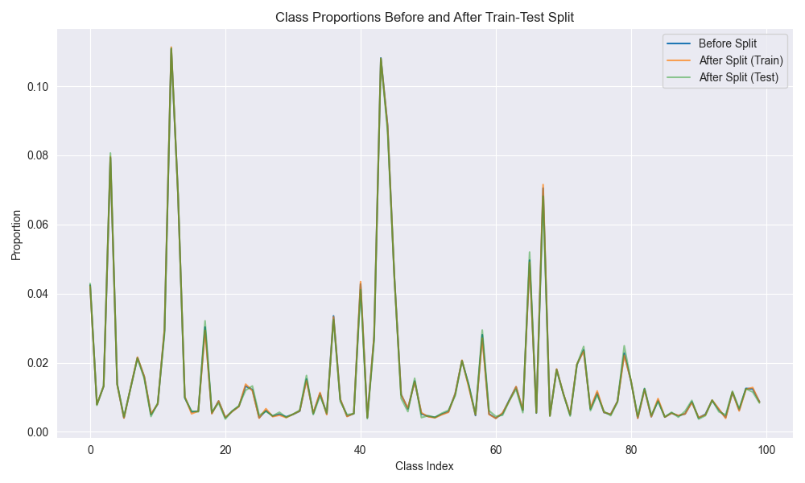
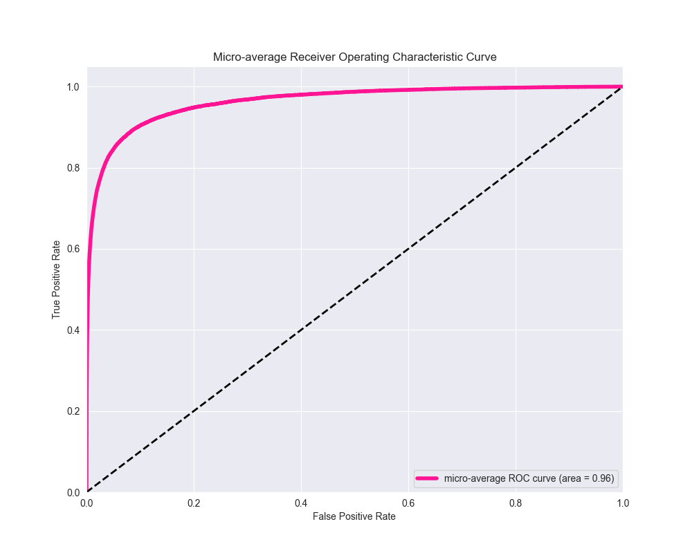

# Tag Prediction Stack Overflow (NLP)
```python
Author -> Stefanos Ginargyros
```


## Introduction

In 2019 Stack Overflow realeased a [public dataset](https://www.kaggle.com/datasets/stackoverflow/stacksample) (Kaggle), named 10% of Stack Overflow Q&A. Its a very quality dataset, including text from 10% of Stack Overflow questions and answers on programming topics. In this project we are automatically predicting the tags of the questions, utilizing a variety of `NLP` tools and models. This is one of the demanding classification problems since it incorporates at the same time multi-label (cardinality >2) and multi-class (>1) targets. Fortunatelly enough, we have fresh tools 🤗 and ideas/ papers attacking these kind of problems, given there is enough compute! 

## Dataset

The raw dataset by default is split in 3 CSV files:

- `Questions.csv`: There is usefull information including cumulative question scores, ids, creation and closing datetimes and more importantly the **Title** and **Body** for each question.

- `Answers.csv`: Includes ids, and answers for each question. Every question can be pointed by many answer ids. Its many to one.

- `Tags.csv`: Includes ids, and tags for each question. Every question can be pointed by many tag ids. Its many to one as well.


## Installation & Usage (Quick-commands)

So there are three ways of handling with the installation. 

-  `Locally`: You can install & run everything locally:

    ```bash
        # dirs, folders etc.
        cd stackoverflow-tag-prediction
        mkdir /data
        mkdir /output
    
        # fetch files from google drive, dump in dirs
        pip install gdown
        gdown --id 1Udrd9a944rJH0GxDhR6052gGNksb7rXO -O data/df_eda.pkl
        gdown --id 1u8PWLs_SqSq0SMBXZSIB1LG59oror_B7 -O data/Questions.csv
        gdown --id 1ooskIp7eb7QOMeK1yJxXE1KkZoDARdfW -O data/Tags.csv

        # create the env & activate, install deps
        conda create -n stackoverflow python=3.10
        conda activate stackoverflow

        # runs exps
        pip install -r requirements.txt
        python3 eda.py
        python3 model_A_train_infer.py
    ```

- `Docker`: You can build and run everything in auto, through my Docker image in this repo:

    ```bash
        # build the image
        docker build -t docker-eda-mlmodel -f Dockerfile .

        # run exps
        docker run docker-eda-mlmodel python3 eda.py
        docker run docker-eda-mlmodel python3 model_A_train_infer.py 
    ```

- `Collab`: Or you can completely skip the installation, and directy use these collab notebooks and run the advanced LLM experiments on cloud GPU's. This includes training, finetuning and predicting utilizing a Large Language Model (BERT, distilBERT etc) on StackOverflow data.

    [bert_fine_stackoverflow_v6_train.ipynb](https://colab.research.google.com/drive/1IlNwHCM2rWZqZMNiByoGzAq-M7p2FWui?usp=sharing)


    [bert_fine_stackoverflow_v6_infer.ipynb](https://colab.research.google.com/drive/18JgKJEwGVjYK3QisDOOe1PkHKEA5Btyy?usp=sharing)


## Installation & Usage Locally (Detailed)
Since you want to install all the dependencies and run the exps locally, this section will guide you through step by step. The following directories are needed for the scripts to run locally. Every script is pointing to a data folder so you can either do the following (easy) or change the directories manually in the scripts.

```bash
    # dirs, folders etc.
    cd stackoverflow-tag-prediction
    mkdir /data
    mkdir /output    
```
Bear in mind that you will have to manually download the dataset, if you go this way (locally). For your convience I have them uploaded and you can download them automatically with one simple script attached bellow. They will be extracted in the `-O` flag directory of the gdown command. For example I export them in the data folder (it must be an existing folder, from the previous step), since this is the folder all of the scripts are pointing.

```bash
    # fetch files from google drive
    pip install gdown
    gdown --id 1Udrd9a944rJH0GxDhR6052gGNksb7rXO -O data/df_eda.pkl
    gdown --id 1u8PWLs_SqSq0SMBXZSIB1LG59oror_B7 -O data/Questions.csv
    gdown --id 1ooskIp7eb7QOMeK1yJxXE1KkZoDARdfW -O data/Tags.csv
```

Usually I choose to create conda virtual envs when playing with new projects, especially when i do it locally.

```bash 
    # create the env, and activate
    conda create -n stackoverflow python=3.10
    conda activate stackoverflow
```

And then you can run the EDA and ML [cpu] experiments on your machine. 

```bash
    # run eda on stack overflow data
    python3 eda.py 
```

```bash
    # predict tags  on stack overflow data, with ML model [cpu]
    python3 model_A_train_infer.py 
```

Of-course this is easily extendable, and you can still play arround with the more advanced LLM models as well (if you have GPUs, CUDA etc.).

```bash
    # predict tags  on stack overflow data, with a BERT finetuned model [gpu]
    python3 model_B_tain.py
    python3 model_B_infer.py
```


## Installation & Usage Docker (Detailed)
Don't stress about the Data, or the Dataset here, I have automated scripts downloading every part of the data and making dirs where you need them. You will just need to run these three lines:

```bash
    # build the image
    docker build -t docker-eda-mlmodel -f Dockerfile .
```
```bash
    # run eda on stack overflow data
    docker run docker-eda-mlmodel python3 eda.py 
```

```bash
    # run ML model [cpu] on stack overflow data
    docker run docker-eda-mlmodel python3 model_A_train_infer.py 
```

## Usage Collab (Detailed)

Follow my links, log-in to Google, and then choose as your runtime a GPU. (if you are subscriber you can even pick an A100, if not just a Tesla T4 for a limited time).

[bert_fine_stackoverflow_v6_train.ipynb](https://colab.research.google.com/drive/1IlNwHCM2rWZqZMNiByoGzAq-M7p2FWui?usp=sharing)

[bert_fine_stackoverflow_v6_infer.ipynb](https://colab.research.google.com/drive/18JgKJEwGVjYK3QisDOOe1PkHKEA5Btyy?usp=sharing)


## Project Structure 
The structure of the project follows classic NLP pipelines:
    
 - Exploratory Data Analysis on the whole Stack Overflow Dataset [`eda.py`]
    - Nulls, Duplicates
    - Frequent Target Analysis
    - Plots
    - Dataframe Operations (joins, chops)
    - Target Distribution
    - Loseless Dataset Shrinking (as possible)
    - Text Length Outliers (huge texts, encodings)
    - Stip Html (beatiful soup)
    - Accented characters
    - Special characters 
    - Lemmatization (playing, player -> play)
    - Expansion of contractions (ain't -> is not)

 - ML Model for Tag Prediction [`model_A_train_infer.py`]
    - Input Vectorization (Tfid)
    - Target Binarization (MultiLabelBinarizer)
    - Train/Val/Test Splits 
    - Target Distribution Cross Check
    - Model Selection (cpu currently)
    - Metrics (hamming, jaccard, f1, precision, recall)
    - Plots (AUC, ROC etc.)

 - LLM Model for Tag Prediction [`collab links`]
    - Label Binarization
    - Input Tokenization (BERT)
    - Dataset/Dataloader
    - Model (LLM + Classifier)
    - Train/Eval Loops
    - Metrics (micro-avg & tag frequent)


# Project Results 
Some interesting findings can be obtained through the Exploratory Data Analysis step [`eda.py`] and the [`model_A_train_infer.py`] for the ML[cpu] model.

- Through the EDA, the part that stand out to me are the frequencies of the tags plotted. 
    
    

- Here is the distribution of tags `Before` the train/test split and `After` the train/test split. We are ensuring it remains the same. In a) bars, and b) plots:


    
    

- Micro Average and Macro Average ROC Curves, and their AUC bottom right.

    
    

- ROC for the top 10 tags (from the first plot)

    

- ROC for all the tags 

    


## Numerical Benchmarks Micro-Average:
Numerical Benchmarks on the 10% of Stack Overflow Q&A Dataset for all the tags micro-averaged. Both of the models where fed the exact same input data, and tested on the exact same test-set. The dataset got carefully splitted in both cases 72% train, 8% validation and 20% test (while cross cheked the label distributions before and after the split in both cases).

| MODEL         | Precision     | Recall          |F-1          | True-Count    |Hamming Loss    |Jaccard score             | ~Time                 |
| ------------- | ------------- | ------------- | ------------- | ------------- | ------------- | -------------             |-------------          |
| LinearSVC     | 0.80141       | 0.4161        | 0.5478        | -             | 0.0108        | 0.3772                    | < 1 min (M1 Pro)      |
| BERT          | 0.8367        | 0.4596        | 0.5933        | -             | 0.0099        | 0.4218                    | > 5 hours (Tesla T4)  |


## Numerical Benchmarks Frequent Tags AVG:
Numerical Benchmarks on the 10% of Stack Overflow Q&A Dataset for the top 10 tags. These tags in descending frequency order are: 
```
    [javascript,java, c#, php, android, jquery, python, html, c++, ios ]
```
| MODEL         | Precision     | Recall          |F-1          | True-Count    |Hamming Loss    |Jaccard score     | ~Time                  |
| ------------- | ------------- | ------------- | ------------- | ------------- | ------------- | -------------     |-------------           |
| LinearSVC     | 0.8002        | 0.5096        | 0.6194        | 1115.3        |  0.0411       | 0.4636            | < 1 min (M1 Pro)       |
| BERT          | 0.8223        | 0.6647        | 0.7197        | 1115.3        | 0.0308        | 0.5875            | > 5 hours (Tesla T4)   |

